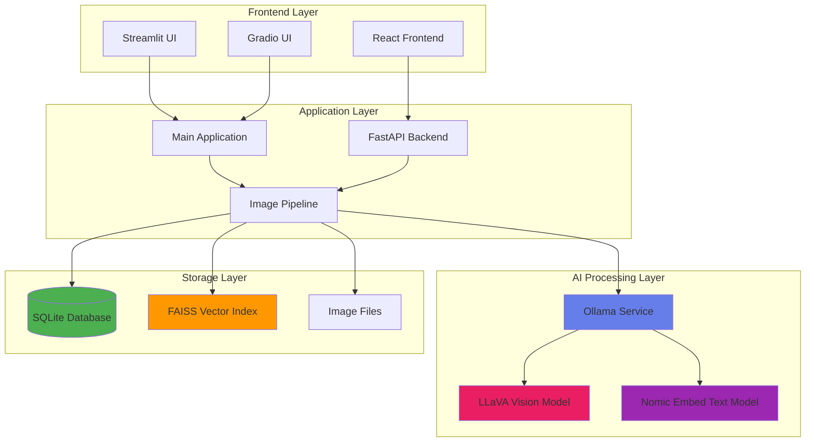
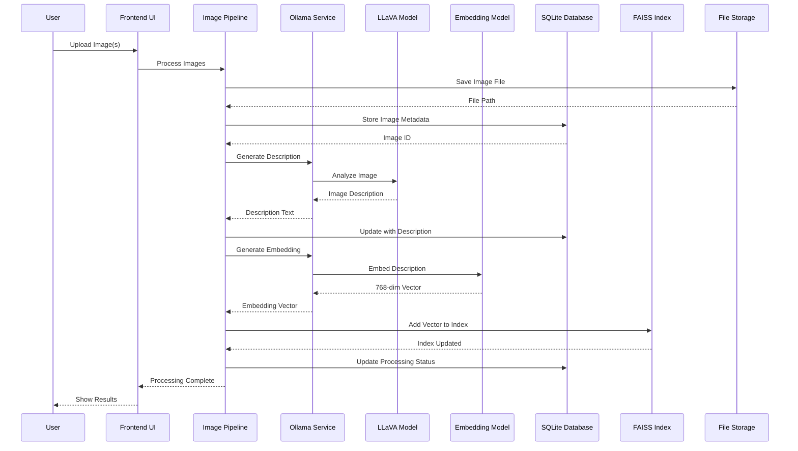
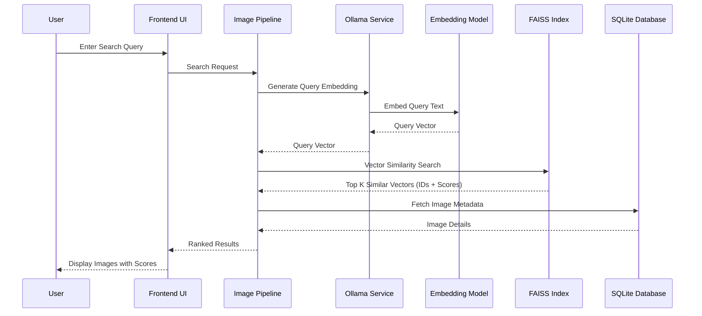
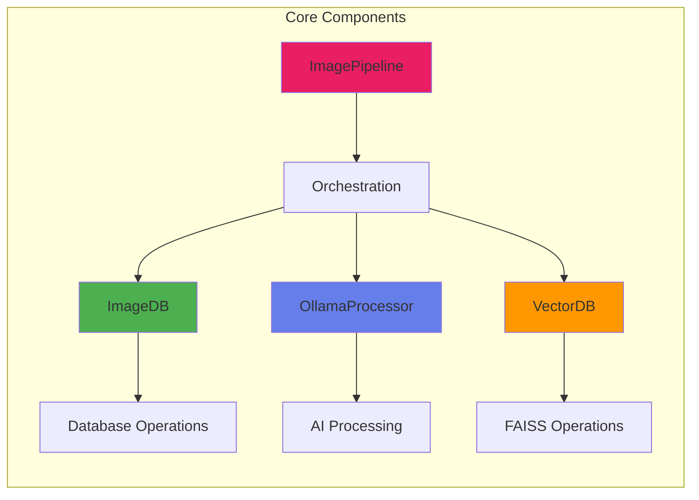
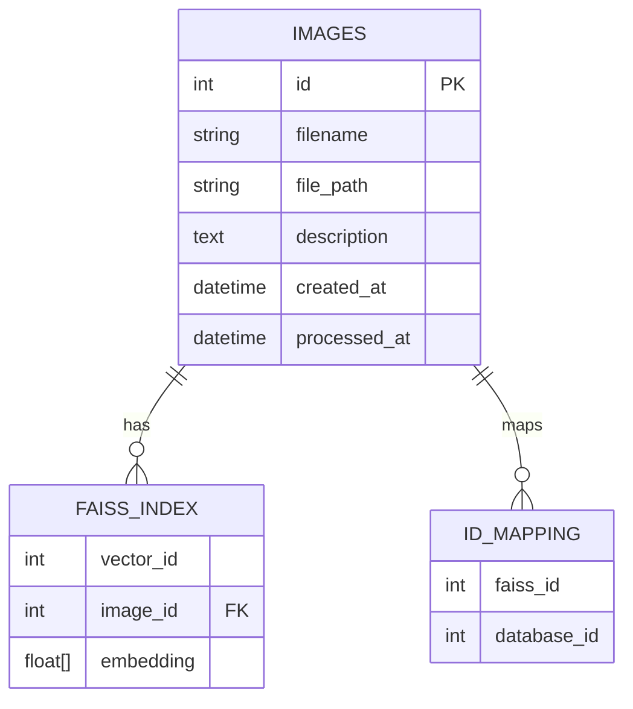
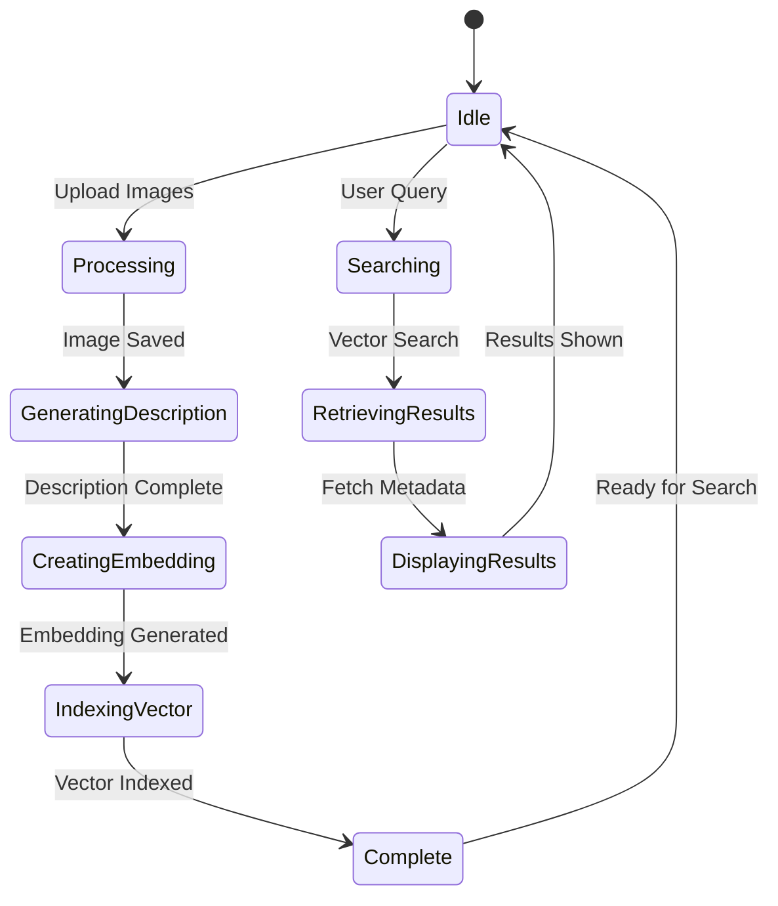
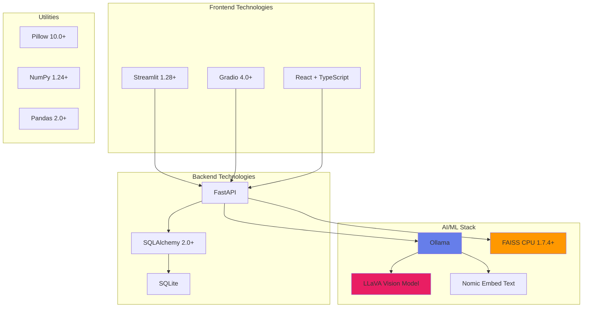
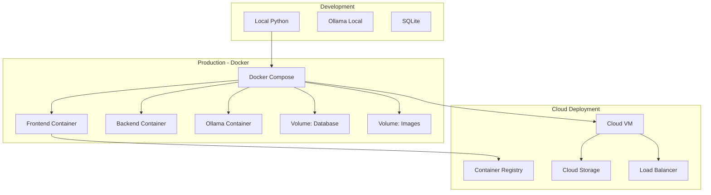
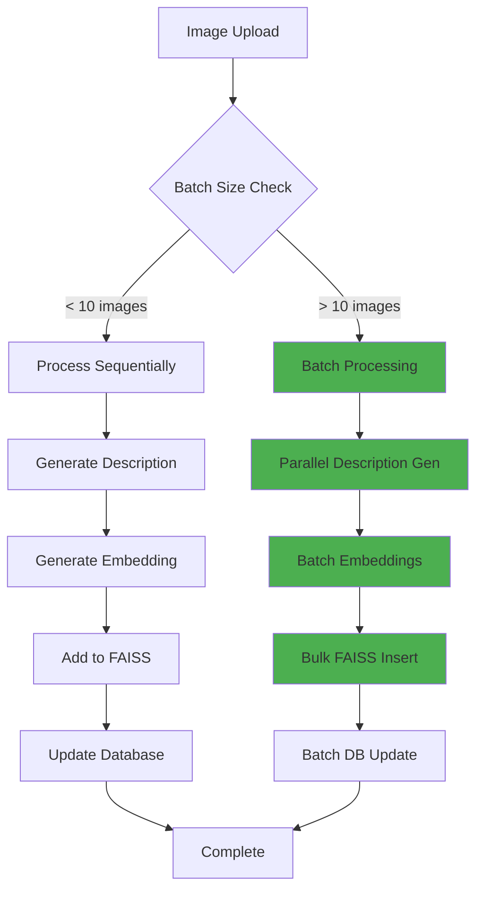
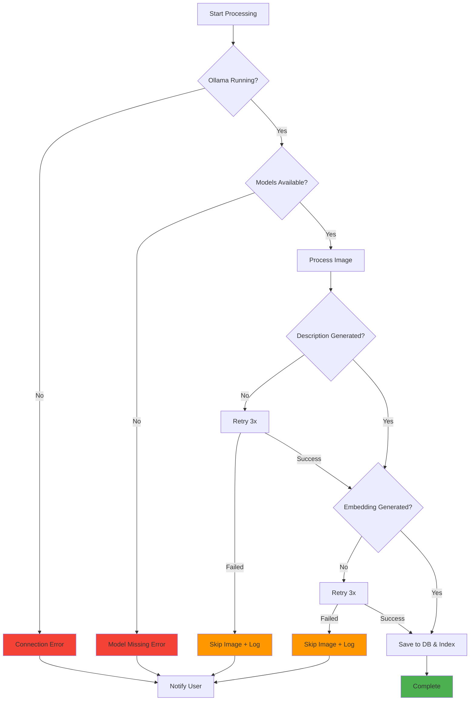

# Image Search System - Architecture Diagram

## System Architecture Overview



## Detailed Data Flow

### Upload & Processing Flow



### Search Flow



## Component Architecture



## Database Schema



## System States



## Technology Stack



## Deployment Options



## Performance Optimization Flow



## Error Handling & Recovery



---

## Quick Reference

### Key Metrics
- **Embedding Dimension**: 768
- **Default Search Results**: 10
- **Vector Index Type**: FAISS Flat (L2)
- **Database**: SQLite with SQLAlchemy ORM

### API Endpoints (if using FastAPI backend)
```
POST   /api/upload          - Upload images
POST   /api/search          - Search images
GET    /api/images          - List all images
GET    /api/images/{id}     - Get image details
DELETE /api/images/{id}     - Delete image
POST   /api/rebuild-index   - Rebuild FAISS index
GET    /api/status          - System status
```

### File Structure
```
Image_Search/
├── streamlit_app.py      # Streamlit UI
├── gradio_app.py         # Gradio UI  
├── backend/
│   └── api.py           # FastAPI backend
├── frontend/            # React frontend
├── images/              # Uploaded images
├── faiss_indexes/       # Vector indexes
└── image_search.db      # SQLite database
```

